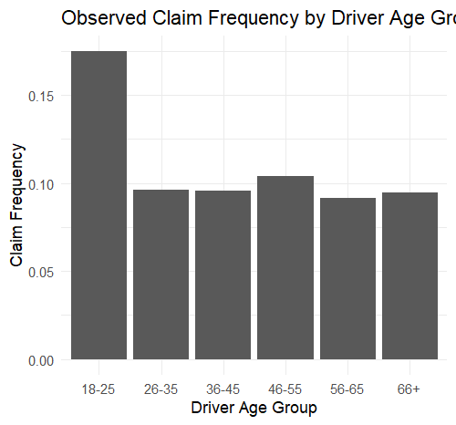
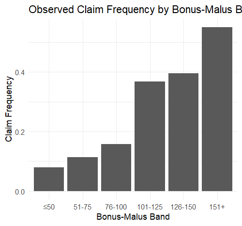

# Motor Insurance Claim Frequency Modelling using GLMs

## Project Overview

This project develops a claim frequency model for motor insurance using Generalized Linear Models (GLMs).

The analysis uses the French Motor Third-Party Liability (MTPL) dataset and demonstrates how actuarial modelling techniques can be used to analyse claim frequency and identify factors associated with insurance risk.

## Objectives

- Explore motor insurance claim frequency data
- Analyse the relationship between claim frequency and policyholder/vehicle characteristics
- Build a Poisson GLM for claim counts
- Check for overdispersion
- Develop a Negative Binomial GLM
- Compare competing models using AIC
- Interpret model coefficients as claim frequency relativities

## Data

The analysis uses the French Motor Third-Party Liability (MTPL) frequency dataset.

Key variables include:

- `ClaimNb` – number of claims
- `Exposure` – policy exposure
- `DrivAge` – driver age
- `VehAge` – vehicle age
- `VehPower` – vehicle power
- `BonusMalus` – bonus-malus score
- `Area` – geographical area
- `VehGas` – fuel type

The dataset is not included in this repository due to its size. The analysis script expects the dataset to be available locally as `freMTPL2freq.csv`.

## Methodology

### 1. Exploratory Analysis

The dataset was examined for:

- Missing values
- Claim count distribution
- Exposure distribution
- Overall claim frequency
- Claim frequency across driver age groups and Bonus-Malus bands

### 2. Poisson GLM

A Poisson GLM was initially fitted to model claim counts.

An exposure offset was included:

`offset(log(Exposure))`

This allows the model to account for different policy exposure periods and effectively models claim frequency rather than simply claim counts.

### 3. Overdispersion

The Pearson dispersion statistic for the Poisson model was approximately **2.69**, indicating overdispersion relative to the Poisson assumption.

### 4. Negative Binomial GLM

A Negative Binomial GLM was therefore fitted to account for additional variation in claim counts.

The Negative Binomial model produced a substantially lower AIC than the Poisson model.

### 5. Final Model

The final model used driver age groups instead of treating driver age as a purely linear variable.

The final model was:

`ClaimNb ~ AgeGroup + VehAge + VehPower + BonusMalus + Area + VehGas + offset(log(Exposure))`

The Negative Binomial model with age groups had the lowest AIC among the models considered.

## Key Findings

Some notable relativities from the final model include:

- Drivers aged **26–35** had an estimated claim frequency approximately **15% lower** than drivers aged 18–25.
- Drivers aged **46–55** had an estimated frequency approximately **29% higher** than the 18–25 reference group.
- A one-unit increase in `BonusMalus` was associated with approximately **2.4% higher** expected claim frequency, holding other variables constant.
- Area E had an estimated claim frequency approximately **23% higher** than the reference area.
- The final model had a Pearson dispersion statistic of approximately **2.58**.

These results demonstrate how GLMs can be used to quantify differences in insurance claim risk across policyholder and vehicle characteristics.

## Visualisations

### Claim Frequency by Driver Age Group

### Claim Frequency by Bonus-Malus Band

## Tools Used

- R
- RStudio
- Generalized Linear Models
- Poisson Regression
- Negative Binomial Regression
- ggplot2
- MASS

## Limitations

This is a mini-project intended to demonstrate actuarial modelling concepts.

The analysis does not include:

- Train/test validation
- Model calibration
- Interaction effects
- Advanced variable selection
- Smoothing techniques
- Production pricing implementation

These could be explored in a more advanced pricing project.

## Author

Pavithra, actuarial science student, statistics graduate
